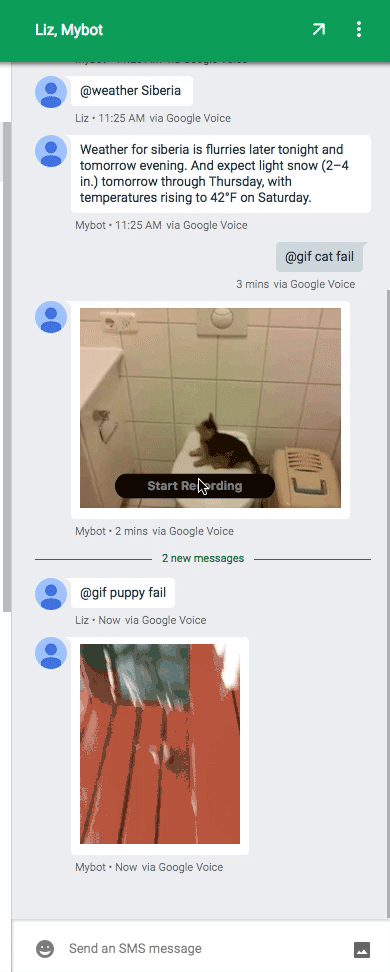

# We Should

Group MMS bot powered by [Bandwidth](http://dev.bandwidth.com).

If you want to learn more, please contact [openapi@bandwidth.com](mailto:openapi@bandwidth.com) or call (888) 686-9944.

## Usage Commands

Add `415-723-1444` to a new group message thread (or directly) and text:

* `@gif phrase` -> Pulls gif from [Giphy](http://giphy.com/)
* `@weather location` -> Pulls weather from [DarkSky](https://darksky.net/)

Anything else is ignored and your chat continues as normal



## Deploy

### Run front end

#### Clone this repo
```bash
git clone https://github.com/dtolb/weshould.git
cd weshould
```

#### Install dependecies

```bash
npm run install-all
```

#### Run server

```bash
npm start
```

The Server will automatically reload all your changes after you save any `.js`, `.html`, or `.css` file.

To Resart type `rs` and enter

#### Front end

All front end files are located in `public/`


### Pre Reqs
* [Bandwidth Credentials](http://dev.bandwidth.com)
* [Dark Sky Key](https://darksky.net/dev/)
* [Google Maps Key](https://developers.google.com/maps/documentation/geolocation/intro)
* Bandwidth [`/application`](http://dev.bandwidth.com/howto/incomingCallandMessaging.html) configured with group messaging.

### Env Vars
* `BANDWIDTH_USER_ID`
* `BANDWIDTH_API_TOKEN`
* `BANDWIDTH_API_SECRET`
* `DARKSKY_KEY`
* `GOOGLE_KEY`
* `DATABASE_URL`

### Run
`npm install`
`npm start`

